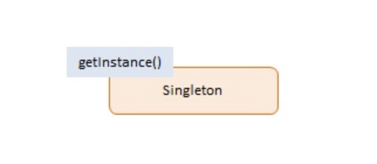
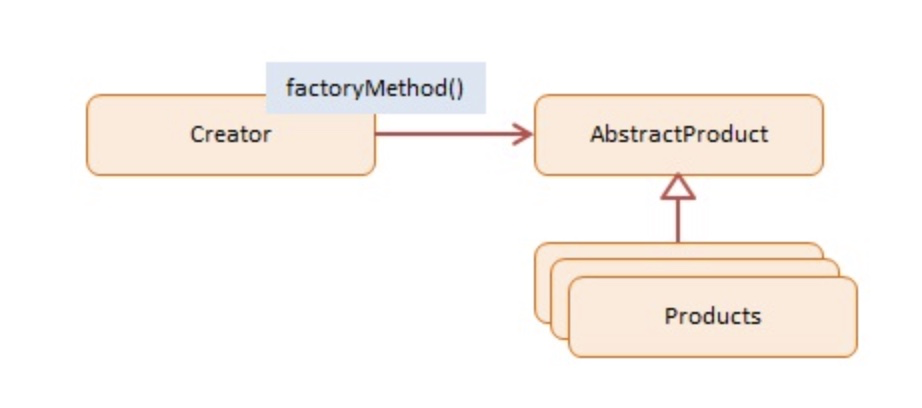
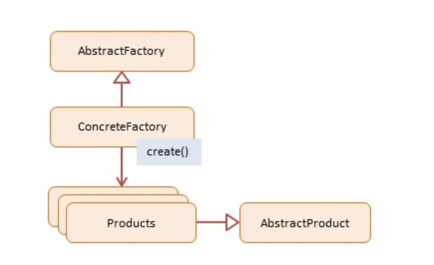
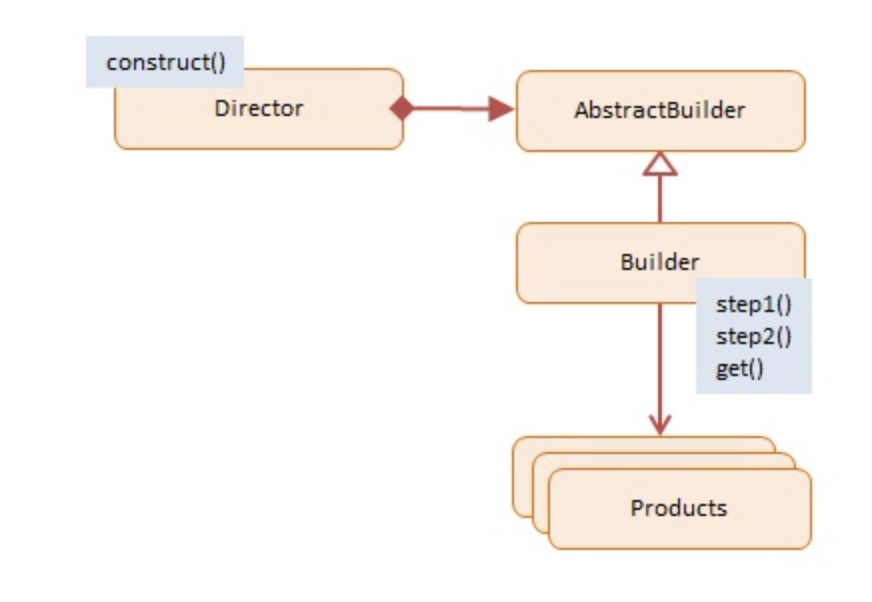
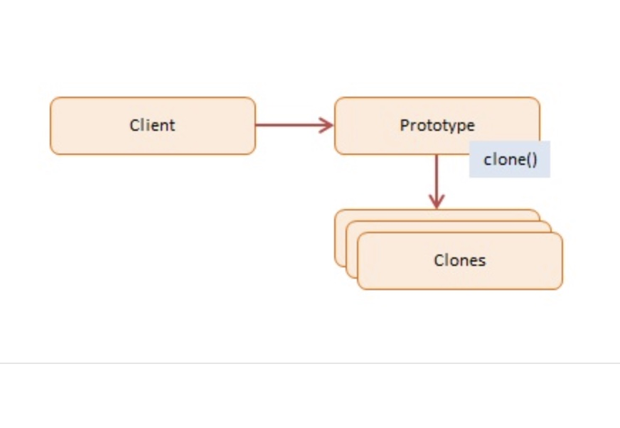
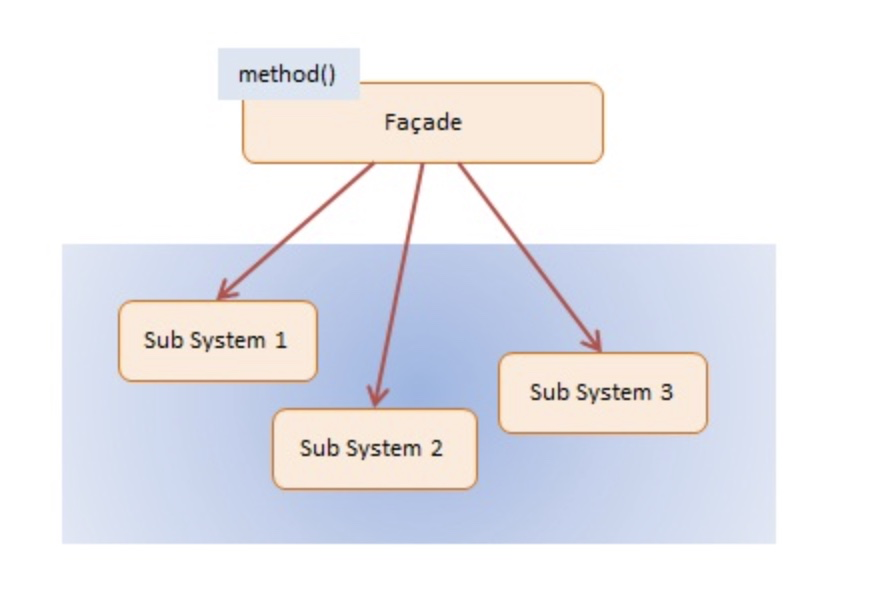
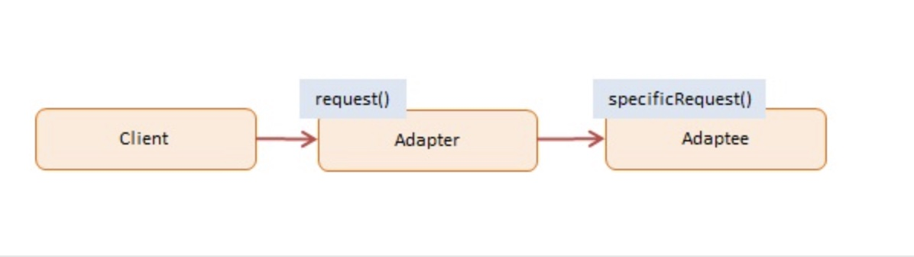
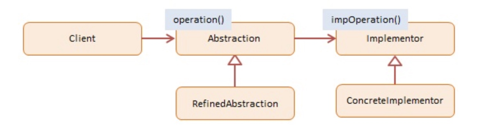
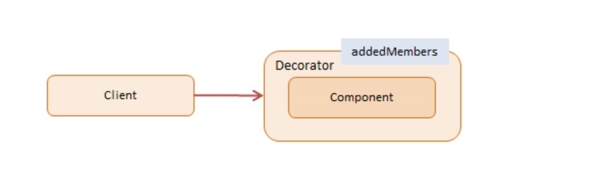
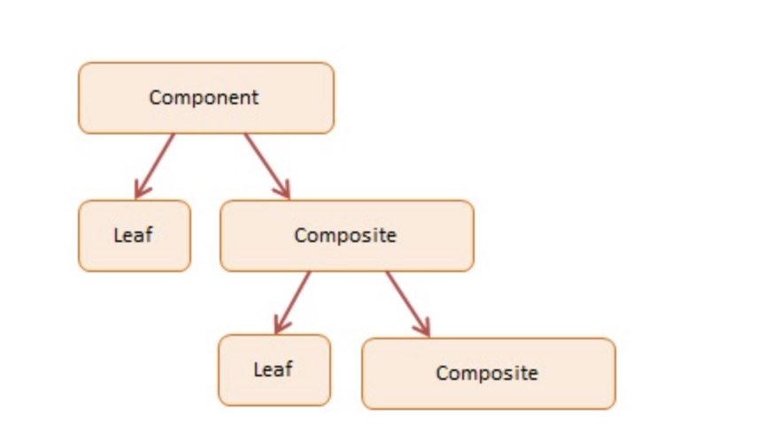

##Creational Patterns

_Шаблон Singleton ограничивает количество экземпляров конкретного объекта до одного. Этот единственный экземпляр называется синглтоном._

### Singleton



<details>
<summary>example</summary>

```
var Singleton = (function () {
    var instance;

    function createInstance() {
        var object = new Object("I am the instance");
        return object;
    }

    return {
        getInstance: function () {
            if (!instance) {
                instance = createInstance();
            }
            return instance;
        }
    };
})();

function run() {

    var instance1 = Singleton.getInstance();
    var instance2 = Singleton.getInstance();

    console.log("Same instance? " + (instance1 === instance2));
}
```

</details>

<details>
<summary>comment</summary>

Объект Singleton реализован как непосредственная анонимная функция . Функция выполняется немедленно, заключая ее в квадратные скобки, за которыми следуют две дополнительные скобки. Он называется анонимным, потому что у него нет имени.

Метод getInstance является привратником Синглтона. Он возвращает единственный экземпляр объекта, сохраняя при этом частную ссылку на него, недоступную для внешнего мира.

Этот getInstance метод демонстрирует еще один шаблон проектирования под названием Lazy Load. Отложенная загрузка проверяет, был ли уже создан экземпляр; если нет, он создает его и сохраняет для дальнейшего использования. Все последующие вызовы будут получать сохраненный экземпляр. Ленивая загрузка — это метод экономии ресурсов ЦП и памяти путем создания объектов только в случае крайней необходимости.

</details>


### Factory Method



* Создатель -- в примере кода: 
  * Фабрика
  объект «фабрика», который создает новые продукты
  
  * реализует factoryMethod, который возвращает вновь созданные продукты
  
* AbstractProduct -- не используется в JavaScript
объявляет интерфейс для продуктов

* ConcreteProduct -- В примере кода: Сотрудники
  * продукт, который создается 
  * все продукты поддерживают один и тот же интерфейс (свойства и методы)


<details>
<summary>example</summary>

```
var Factory = function () {
    this.createEmployee = function (type) {
        var employee;

        if (type === "fulltime") {
            employee = new FullTime();
        } else if (type === "parttime") {
            employee = new PartTime();
        } else if (type === "temporary") {
            employee = new Temporary();
        } else if (type === "contractor") {
            employee = new Contractor();
        }

        employee.type = type;

        employee.say = function () {
            console.log(this.type + ": rate " + this.hourly + "/hour");
        }

        return employee;
    }
}

var FullTime = function () {
this.hourly = "$12";
};

var PartTime = function () {
this.hourly = "$11";
};

var Temporary = function () {
this.hourly = "$10";
};

var Contractor = function () {
this.hourly = "$15";
};

function run() {

    var employees = [];
    var factory = new Factory();

    employees.push(factory.createEmployee("fulltime"));
    employees.push(factory.createEmployee("parttime"));
    employees.push(factory.createEmployee("temporary"));
    employees.push(factory.createEmployee("contractor"));

    for (var i = 0, len = employees.length; i < len; i++) {
        employees[i].say();
    }
}
```
</details>

<details>
<summary>comment</summary>
В этом примере JavaScript Factoryобъект создает четыре разных типа сотрудников. Каждый тип сотрудников имеет свою почасовую ставку. Метод createEmployeeявляется фактическим фабричным методом. Клиент указывает фабрике, какой тип сотрудника создать, передавая аргумент типа в метод фабрики.


AbstractProduct на диаграмме не реализован, поскольку Javascript не поддерживает абстрактные классы или интерфейсы. Однако нам все еще нужно убедиться, что все типы сотрудников имеют одинаковый интерфейс (свойства и методы).


Создаются четыре разных типа сотрудников; все хранятся в одном массиве. Каждого работника просят сказать, кто они и их почасовая ставка.
</details>

### Abstract Factory

_Абстрактная фабрика создает объекты, связанные общей темой. В объектно-ориентированном программировании Factory — это объект, который создает другие объекты. Абстрактная фабрика абстрагирует тему, которая является общей для вновь созданных объектов._



* AbstractFactory -- не используется в JavaScript
объявляет интерфейс для создания продуктов

* ConcreteFactory -- В примере кода: EmployeeFactory, VendorFactory

  * фабричный объект, который «производит» новые продукты
  
  * метод create() возвращает новые продукты

* Продукты -- В примере кода: Сотрудник, Поставщик

  * экземпляры продукта, создаваемые фабрикой

* AbstractProduct -- не используется в JavaScript

  * объявляет интерфейс для создаваемых продуктов

<details>
<summary>example</summary>

```
function Employee(name) {
    this.name = name;

    this.say = function () {
        console.log("I am employee " + name);
    };
}

function EmployeeFactory() {

    this.create = function (name) {
        return new Employee(name);
    };
}

function Vendor(name) {
this.name = name;

    this.say = function () {
        console.log("I am vendor " + name);
    };
}

function VendorFactory() {

    this.create = function (name) {
        return new Vendor(name);
    };
}

function run() {
var persons = [];
var employeeFactory = new EmployeeFactory();
var vendorFactory = new VendorFactory();

    persons.push(employeeFactory.create("Joan DiSilva"));
    persons.push(employeeFactory.create("Tim O'Neill"));
    persons.push(vendorFactory.create("Gerald Watson"));
    persons.push(vendorFactory.create("Nicole McNight"));

    for (var i = 0, len = persons.length; i < len; i++) {
        persons[i].say();
    }
}
```
</details>

<details>
<summary>comment</summary>
JavaScript не поддерживает наследование на основе классов, поэтому абстрактные классы, изображенные на диаграмме, в примере JavaScript не используются. Абстрактные классы и интерфейсы обеспечивают согласованные интерфейсы в производных классах. В JavaScript мы должны сами обеспечить эту согласованность, убедившись, что каждый «конкретный» объект имеет то же определение интерфейса (т. е. свойства и методы), что и другие.


В примере у нас есть два бетонных завода: EmployeeFactoryи VendorFactory. Первый создает Employeeэкземпляры, второй Vendorэкземпляры. Оба продукта являются типами людей (с одинаковым интерфейсом), что позволяет клиенту относиться к ним одинаково. Создается массив с двумя сотрудниками и двумя поставщиками. Затем каждого человека просят сказать, кто он и что он собой представляет.


</details>

###  Builder

_Шаблон Builder позволяет клиенту создать сложный объект, указав только тип и содержимое. Детали конструкции полностью скрыты от клиента._

_Наиболее распространенной мотивацией для использования Builder является упрощение клиентского кода, создающего сложные объекты. Клиент по-прежнему может управлять шагами, предпринимаемыми Строителем, не зная, как выполняется реальная работа._



* Директор -- В примере кода: Магазин

  * создает продукты, используя многошаговый интерфейс Builder

* Строитель -- не используется в JavaScript

  * декларирует многошаговый интерфейс для создания сложного продукта

* ConcreteBuilder -- В примере кода: CarBuilder, TruckBuilder

  * реализует многошаговый интерфейс Builder
  
  * поддерживает продукт в процессе сборки
  
  * предлагает возможность получить только что созданный продукт

* Продукты -- В примере кода: Автомобиль, Грузовик

  * представляет сложные объекты, собираемые


<details>
<summary>example</summary>

```
function Shop() {
    this.construct = function (builder) {
        builder.step1();
        builder.step2();
        return builder.get();
    }
}

function CarBuilder() {
this.car = null;

    this.step1 = function () {
        this.car = new Car();
    };

    this.step2 = function () {
        this.car.addParts();
    };

    this.get = function () {
        return this.car;
    };
}

function TruckBuilder() {
this.truck = null;

    this.step1 = function () {
        this.truck = new Truck();
    };

    this.step2 = function () {
        this.truck.addParts();
    };

    this.get = function () {
        return this.truck;
    };
}

function Car() {
this.doors = 0;

    this.addParts = function () {
        this.doors = 4;
    };

    this.say = function () {
        console.log("I am a " + this.doors + "-door car");
    };
}

function Truck() {
this.doors = 0;

    this.addParts = function () {
        this.doors = 2;
    };

    this.say = function () {
        console.log("I am a " + this.doors + "-door truck");
    };
}

function run() {
var shop = new Shop();
var carBuilder = new CarBuilder();
var truckBuilder = new TruckBuilder();
var car = shop.construct(carBuilder);
var truck = shop.construct(truckBuilder);

    car.say();
    truck.say();
}

```
</details>

<details>
<summary>comment</summary>
AbstractBuilder не используется, поскольку JavaScript не поддерживает абстрактные классы. Однако разные сборщики должны реализовывать один и тот же многошаговый интерфейс, чтобы директор мог пошагово выполнять процесс сборки.


В коде JavaScript есть объект Shop(директор) и два объекта-строителя: CarBuilderи TruckBuilder. 
Метод построения магазина принимает экземпляр Builder, который затем выполняет ряд шагов сборки: шаг 1 и шаг 2. Метод get Builder возвращает только что собранные продукты ( Carобъекты и Truckобъекты).


Клиент контролирует реальный процесс строительства объекта, предлагая Магазину различных строителей.


</details>

### Prototype

_Шаблон прототипа создает новые объекты, но вместо создания неинициализированных объектов он возвращает объекты, инициализированные значениями, скопированными из объекта-прототипа или примера. Шаблон прототипа также называется шаблоном свойств._

Примером использования шаблона прототипа является инициализация бизнес-объектов со значениями, которые соответствуют значениям по умолчанию в базе данных. Объект-прототип содержит значения по умолчанию, которые копируются во вновь созданный бизнес-объект.

Классические языки редко используют шаблон прототипа, но JavaScript, будучи языком прототипов, использует этот шаблон при создании новых объектов и их прототипов.



Объекты, участвующие в этом шаблоне:

* Клиент -- В примере кода: функция run().

  * создает новый объект, запрашивая у прототипа клонирование самого себя

* Прототип -- в примере кода: CustomerPrototype

  * создает интерфейсы для клонирования самого себя

* Клоны -- В примере кода: Customer

  * клонированные объекты, которые создаются


<details>
<summary>example</summary>

```
function CustomerPrototype(proto) {
    this.proto = proto;

    this.clone = function () {
        var customer = new Customer();

        customer.first = proto.first;
        customer.last = proto.last;
        customer.status = proto.status;

        return customer;
    };
}

function Customer(first, last, status) {

    this.first = first;
    this.last = last;
    this.status = status;

    this.say = function () {
        console.log("name: " + this.first + " " + this.last +
            ", status: " + this.status);
    };
}

function run() {

    var proto = new Customer("n/a", "n/a", "pending");
    var prototype = new CustomerPrototype(proto);

    var customer = prototype.clone();
    customer.say();
}

```
</details>

<details>
<summary>comment</summary>

В примере кода у нас есть CustomerPrototypeобъект, который клонирует объекты с заданным объектом-прототипом. Его функция-конструктор принимает прототип типа Customer. Вызов cloneметода создаст новый Customerобъект со значениями его свойств, инициализированными значениями прототипа.


Это классическая реализация шаблона прототипа, но JavaScript может делать это гораздо эффективнее, используя встроенные средства создания прототипов.
</details>


## Structural Patterns

### Façade
**Один класс, представляющий всю подсистему**
Шаблон фасада предоставляет интерфейс, ограждающий клиентов от сложной функциональности одной или нескольких подсистем. Это простой шаблон, который может показаться тривиальным, но он мощный и чрезвычайно полезный. Он часто присутствует в системах, построенных на основе многоуровневой архитектуры.
<details>
<summary>where use</summary>
Назначение фасада — предоставить высокоуровневый интерфейс (свойства и методы), который упрощает использование подсистемы или инструментария для клиента.

На сервере в многоуровневом веб-приложении у вас часто есть уровень представления, который является клиентом уровня обслуживания. Связь между этими двумя уровнями осуществляется через четко определенный API. Этот API, или фасад, скрывает сложности бизнес-объектов и их взаимодействия с уровнем представления.

Еще одна область, в которой используются фасады, — это рефакторинг. Предположим, у вас есть запутанный или беспорядочный набор устаревших объектов, о которых клиент не должен беспокоиться. Вы можете скрыть этот код за фасадом. Фасад показывает только то, что необходимо, и представляет собой более понятный и простой в использовании интерфейс.

Фасады часто сочетаются с другими узорами дизайна. Сами фасады часто реализуются как одноэлементные фабрики.


</details>




* Фасад -- В примере кода: Ипотека

  * знает, какие подсистемы отвечают за запрос
  
  * делегирует клиентские запросы соответствующим объектам подсистемы

* Подсистемы — в примере кода: Банк, Кредит, Фон

  * реализует и выполняет специализированную функциональность подсистемы
  
  * не знаю и не имею отношения к фасаду


<details>
<summary>example</summary>

```
var Mortgage = function (name) {
    this.name = name;
}

Mortgage.prototype = {

    applyFor: function (amount) {
        // access multiple subsystems...
        var result = "approved";
        if (!new Bank().verify(this.name, amount)) {
            result = "denied";
        } else if (!new Credit().get(this.name)) {
            result = "denied";
        } else if (!new Background().check(this.name)) {
            result = "denied";
        }
        return this.name + " has been " + result +
            " for a " + amount + " mortgage";
    }
}

var Bank = function () {
    this.verify = function (name, amount) {
        // complex logic ...
        return true;
    }
}

var Credit = function () {
    this.get = function (name) {
        // complex logic ...
        return true;
    }
}

var Background = function () {
    this.check = function (name) {
        // complex logic ...
        return true;
    }
}

function run() {
    var mortgage = new Mortgage("Joan Templeton");
    var result = mortgage.applyFor("$100,000");

    console.log(result);
}
```
</details>

<details>
<summary>comment</summary>

Объектом Mortgage является Фасад в примере кода. Он предоставляет клиенту простой интерфейс с единственным методом: applyFor. Но за этим простым API скрывается значительная сложность.

Имя заявителя передается в функцию-конструктор Mortgage. Затем applyFor вызывается метод с запрашиваемой суммой кредита. Внутри этот метод использует службы из 3 отдельных подсистем, которые являются сложными и, возможно, требуют некоторого времени для обработки; они Bank, Credit, и Background.

На основании нескольких критериев (банковские выписки, кредитные отчеты и криминальное прошлое) заявителю либо принимают, либо отказывают в запрашиваемом кредите.


</details>

### Adapter
**Сопоставьте интерфейсы разных классов**

_Шаблон адаптера преобразует один интерфейс (свойства и методы объекта) в другой. Адаптеры позволяют программным компонентам работать вместе, что в противном случае было бы невозможно из-за несоответствия интерфейсов. Шаблон адаптера также называется шаблоном Wrapper Pattern.._

Один из сценариев, в котором обычно используются адаптеры, — это когда необходимо интегрировать новые компоненты и работать вместе с существующими компонентами в приложении.

Другой сценарий — рефакторинг, при котором части программы переписываются с улучшенным интерфейсом, но старый код по-прежнему ожидает исходный интерфейс.




* Клиент -- В примере кода: функция run().

  * вызывает адаптер, чтобы запросить услугу

* Адаптер -- в примере кода: ShippingAdapter

  * реализует интерфейс, который клиент ожидает или знает

* Adaptee -- В примере кода: AdvancedShipping

  * адаптируемый объект 
  * имеет интерфейс, отличный от того, что клиент ожидает или знает


<details>
<summary>example</summary>

```
// old interface

function Shipping() {
    this.request = function (zipStart, zipEnd, weight) {
        // ...
        return "$49.75";
    }
}

// new interface

function AdvancedShipping() {
    this.login = function (credentials) { /* ... */ };
    this.setStart = function (start) { /* ... */ };
    this.setDestination = function (destination) { /* ... */ };
    this.calculate = function (weight) { return "$39.50"; };
}

// adapter interface

function ShippingAdapter(credentials) {
    var shipping = new AdvancedShipping();

    shipping.login(credentials);

    return {
        request: function (zipStart, zipEnd, weight) {
            shipping.setStart(zipStart);
            shipping.setDestination(zipEnd);
            return shipping.calculate(weight);
        }
    };
}

function run() {

    var shipping = new Shipping();
    var credentials = { token: "30a8-6ee1" };
    var adapter = new ShippingAdapter(credentials);

    // original shipping object and interface

    var cost = shipping.request("78701", "10010", "2 lbs");
    console.log("Old cost: " + cost);

    // new shipping object with adapted interface

    cost = adapter.request("78701", "10010", "2 lbs");

    console.log("New cost: " + cost);
}
```
</details>

<details>
<summary>comment</summary>
В приведенном ниже примере кода показана онлайн-корзина, в которой объект доставки используется для расчета стоимости доставки. Старый Shipping объект заменяется новым и улучшенным объектом доставки, который является более безопасным и предлагает более выгодные цены.

Новый объект носит имя AdvancedShipping и имеет совсем другой интерфейс, которого клиентская программа не ожидает. ShippingAdapter позволяет клиентской программе продолжать работу без каких-либо изменений API, отображая (адаптируя) старый Shipping интерфейс к новому AdvancedShipping интерфейсу
</details>

###Bridge
**Отделяет интерфейс объекта от его реализации**

_Шаблон Bridge позволяет двум компонентам, клиенту и службе, работать вместе, при этом каждый компонент имеет собственный интерфейс. Мост — это высокоуровневый архитектурный паттерн, и его основная цель — писать более качественный код с помощью двух уровней абстракции. Это облегчает очень слабое связывание объектов. Иногда его называют шаблоном двойного адаптера._

Примером шаблона моста является приложение (клиент) и драйвер базы данных (служба). Приложение пишет в четко определенный API базы данных, например ODBC, но за этим API вы обнаружите, что реализация каждого драйвера полностью отличается для каждого поставщика базы данных (SQL Server, MySQL, Oracle и т. д.).

Шаблон Bridge — отличный шаблон для разработки драйверов, но он редко встречается в JavaScript.



* Клиент -- В примере кода: функция run().

  * вызывает Абстракцию, чтобы запросить операцию

* Абстракция -- не используется в JavaScript

  * объявляет интерфейс для абстракции первого уровня
  
  * поддерживает ссылку на Implementor

* RefinedAbstraction -- В примере кода: жесты, мышь

  * реализует и расширяет интерфейс, определенный абстракцией

* Реализация -- не используется в JavaScript

  * объявляет интерфейс для второго уровня или абстракции реализации

* ConcreteImplementor -- В примере кода: Экран, Аудио

  * реализует интерфейс Implementor и определяет его эффекты


<details>
<summary>example</summary>

```
// input devices

var Gestures = function (output) {
    this.output = output;

    this.tap = function () { this.output.click(); }
    this.swipe = function () { this.output.move(); }
    this.pan = function () { this.output.drag(); }
    this.pinch = function () { this.output.zoom(); }
};

var Mouse = function (output) {
    this.output = output;

    this.click = function () { this.output.click(); }
    this.move = function () { this.output.move(); }
    this.down = function () { this.output.drag(); }
    this.wheel = function () { this.output.zoom(); }
};

// output devices

var Screen = function () {
    this.click = function () { console.log("Screen select"); }
    this.move = function () { console.log("Screen move"); }
    this.drag = function () { console.log("Screen drag"); }
    this.zoom = function () { console.log("Screen zoom in"); }
};

var Audio = function () {
    this.click = function () { console.log("Sound oink"); }
    this.move = function () { console.log("Sound waves"); }
    this.drag = function () { console.log("Sound screetch"); }
    this.zoom = function () { console.log("Sound volume up"); }
};

function run() {

    var screen = new Screen();
    var audio = new Audio();

    var hand = new Gestures(screen);
    var mouse = new Mouse(audio);

    hand.tap();
    hand.swipe();
    hand.pinch();

    mouse.click();
    mouse.move();
    mouse.wheel();
}

```
</details>

<details>
<summary>comment</summary>

Цель примера — показать, что с помощью шаблона «Мост» устройства ввода и вывода могут изменяться независимо (без изменения кода); устройства слабо связаны двумя уровнями абстракции.

JavaScript не поддерживает абстрактные классы, поэтому абстракция и реализация не включены. Однако их интерфейсы (свойства и методы) последовательно реализованы в RefinedAbstraction и ConcreteImplementor. В нашем примере кода абстракция представляет устройства ввода, а реализатор представляет устройства вывода.

Gestures(движения пальцев) и Mouse являются очень разными устройствами ввода, но их действия соответствуют общему набору инструкций вывода: щелчок, перемещение, перетаскивание и т. д. Screenи Audio являются очень разными устройствами вывода, но они реагируют на один и тот же набор инструкций. Конечно, эффекты совершенно разные, то есть обновления видео и звуковые эффекты. Шаблон Bridge позволяет любому устройству ввода работать с любым устройством вывода.


</details>

## Decorator
**Добавляйте обязанности к объектам динамически**

_Паттерн Decorator динамически расширяет (украшает) extends (decorates) поведение объекта. Возможность добавления нового поведения во время выполнения достигается с помощью объекта Decorator, который «обертывает себя» вокруг исходного объекта. Несколько декораторов могут добавлять или переопределять функциональность исходного объекта._

<details>
<summary>where use</summary>
Примером декоратора является управление безопасностью, когда бизнес-объектам предоставляется дополнительный доступ к привилегированной информации в зависимости от привилегий аутентифицированного пользователя. Например, менеджер по персоналу получает возможность работать с объектом служащего, к которому добавлена ​​(то есть украшена) запись о зарплате служащего, чтобы можно было просмотреть информацию о зарплате.

Декораторы обеспечивают гибкость статически типизированным языкам, допуская изменения во время выполнения, а не наследование, которое происходит во время компиляции. JavaScript, однако, является динамическим языком, и возможность расширения объекта во время выполнения встроена в сам язык.

По этой причине шаблон Decorator менее актуален для разработчиков JavaScript. В JavaScript шаблоны Extend и Mixin включают в себя шаблон Decorator. 
</details>




* Клиент -- В примере кода: функция run()

  * поддерживает ссылку на украшенный компонент

* Компонент -- В примере кода: Пользователь

  * объект, к которому добавляется дополнительная функциональность

* Декоратор -- в примере кода: DecoratedUser

  * "обертывает" компонент, сохраняя ссылку на него
  
  * определяет интерфейс, который соответствует интерфейсу Компонента
  
  * реализует дополнительную функциональность (добавлены члены на диаграмме)


<details>
<summary>example</summary>

```
var User = function (name) {
    this.name = name;

    this.say = function () {
        console.log("User: " + this.name);
    };
}

var DecoratedUser = function (user, street, city) {
    this.user = user;
    this.name = user.name;  // ensures interface stays the same
    this.street = street;
    this.city = city;

    this.say = function () {
        console.log("Decorated User: " + this.name + ", " +
            this.street + ", " + this.city);
    };
}

function run() {

    var user = new User("Kelly");
    user.say();

    var decorated = new DecoratedUser(user, "Broadway", "New York");
    decorated.say();
}
```
</details>

<details>
<summary>comment</summary>
В примере кода Userобъект украшается (улучшается) DecoratedUserобъектом. Он расширяет пользователя несколькими свойствами на основе адреса. Исходный интерфейс должен остаться прежним, что объясняет, почему user.nameон назначается this.name. Кроме того, sayметод DecoratedUser скрывает sayметод User.

Сам JavaScript гораздо эффективнее динамически расширяет объекты дополнительными данными и поведением.
</details>


## Composite
**Древовидная структура простых и составных объектов**

_Шаблон Composite позволяет создавать объекты со свойствами, которые являются примитивными элементами или набором объектов. Каждый элемент в коллекции может содержать другие коллекции, создавая глубоко вложенные структуры._

<details>
<summary>where use</summary>
Элемент управления "дерево" является прекрасным примером шаблона Composite. Узлы дерева содержат либо отдельный объект (листовой узел), либо группу объектов (поддерево узлов).

Все узлы в шаблоне Composite имеют общий набор свойств и методов, который поддерживает как отдельные объекты, так и коллекции объектов. Этот общий интерфейс значительно упрощает разработку и построение рекурсивных алгоритмов, перебирающих каждый объект в коллекции Composite.

</details>




* Компонент -- в примере кода: узел

  * объявляет интерфейс для объектов в композиции

* Лист -- В примере кода: Узел

  * представляет листовые объекты в композиции. Лист не имеет детей

* Композитный -- В примере кода: узел

  * представляет ветви (или поддеревья) в композиции
  
  * поддерживает коллекцию дочерних компонентов


<details>
<summary>example</summary>

```
var Node = function (name) {
    this.children = [];
    this.name = name;
}

Node.prototype = {
add: function (child) {
this.children.push(child);
},

    remove: function (child) {
        var length = this.children.length;
        for (var i = 0; i < length; i++) {
            if (this.children[i] === child) {
                this.children.splice(i, 1);
                return;
            }
        }
    },

    getChild: function (i) {
        return this.children[i];
    },

    hasChildren: function () {
        return this.children.length > 0;
    }
}

// recursively traverse a (sub)tree

function traverse(indent, node) {
console.log(Array(indent++).join("--") + node.name);

    for (var i = 0, len = node.children.length; i < len; i++) {
        traverse(indent, node.getChild(i));
    }
}

function run() {
var tree = new Node("root");
var left = new Node("left")
var right = new Node("right");
var leftleft = new Node("leftleft");
var leftright = new Node("leftright");
var rightleft = new Node("rightleft");
var rightright = new Node("rightright");

    tree.add(left);
    tree.add(right);
    tree.remove(right);  // note: remove
    tree.add(right);

    left.add(leftleft);
    left.add(leftright);

    right.add(rightleft);
    right.add(rightright);

    traverse(1, tree);
}
```
</details>

<details>
<summary>comment</summary>
В нашем примере древовидная структура создается из Nodeобъектов. Каждый узел имеет имя и 4 метода: add, remove, getChildи hasChildren. Методы добавляются в Nodeпрототип. Это снижает требования к памяти, поскольку эти методы теперь используются всеми узлами. Nodeявляется полностью рекурсивным, и нет необходимости в отдельных объектах Component или Leaf.

Небольшое составное дерево строится путем добавления узлов к родительским узлам. После завершения мы вызываем метод, traverse который выполняет итерацию по каждому узлу в дереве и отображает его имя и глубину (показывая отступ).


</details>


## Flyweight

**Детализированный экземпляр, используемый для эффективного обмена**

_Шаблон Flyweight экономит память за счет эффективного совместного использования большого количества мелких объектов. Общие легковесные объекты являются неизменяемыми, то есть их нельзя изменить, поскольку они представляют характеристики, общие с другими объектами._


<details>
<summary>example</summary>
```
PASTE LOGS HERE
```
</details>

<details>
<summary>comment</summary>

</details>


